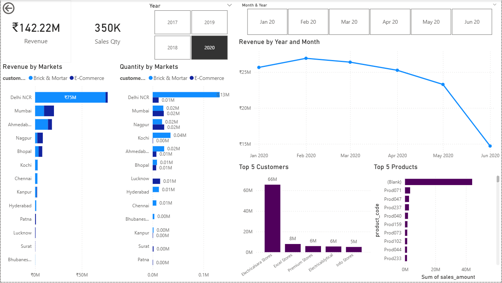
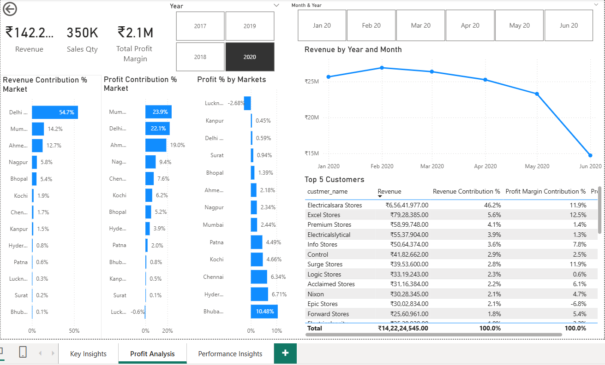
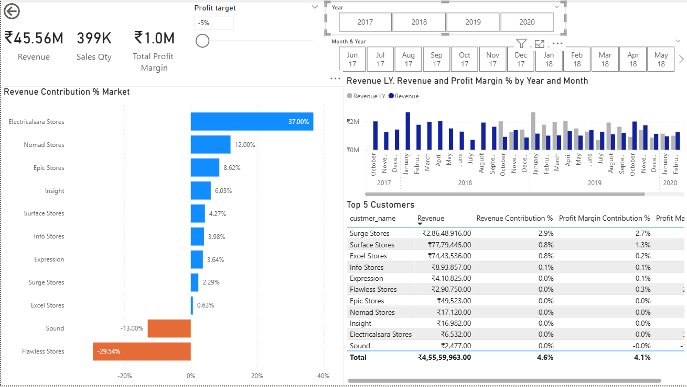

# Sales Insights Dashboard | SQL & Power BI

**Project Overview**
- This project is an **end-to-end sales analytics dashboard** built using **SQL and Power BI**. It focuses on analyzing sales data, generating actionable insights, and supporting **data-driven decision-making** for business stakeholders.

---

## Features

* **Data Extraction & Cleaning:**
  Cleaned, transformed, and aggregated sales data using **SQL queries** and **Power Query** for accurate reporting.

* **Key Insights & Profit Analysis:**
  Identified top-performing products, regions, and loss-making segments to help optimize business strategy.

* **Interactive Dashboards:**
  Created **Power BI dashboards** to monitor KPIs such as revenue, profit margins, and sales trends.

* **Performance Insights:**
  Delivered actionable insights to improve overall sales performance and guide strategic decisions.

---

## Tech Stack

* **Database:** SQL (queries, aggregation, joins)
* **BI Tool:** Microsoft Power BI Desktop
* **Data Transformation:** Power Query
* **Visualization:** Interactive dashboards, KPI cards, charts, and filters

---

## Project Screenshots

### 1️⃣ Key Insights

### 2️⃣ Profit Analysis

### 3️⃣ Performance Insights

---

## Usage

1. Open the **Power BI Desktop** file (`sales_insights_bi.pbix`).
2. Connect it to your **SQL database** or use the provided dataset.
3. Explore **interactive dashboards**, filters, and slicers to view insights.
4. Publish to **Power BI Service** for sharing with stakeholders.

---

## Outcome / Learnings

* Gained hands-on experience in **data cleaning, transformation, and dashboarding**.
* Learned to identify **critical business metrics** and KPIs.
* Understood how to communicate **data-driven insights** effectively for stakeholders.

---

## Future Enhancements

* Add **predictive analytics** to forecast sales trends.
* Integrate **real-time data updates** from the SQL database.
* Enhance dashboard with **more interactive visuals** and drill-downs.

---
